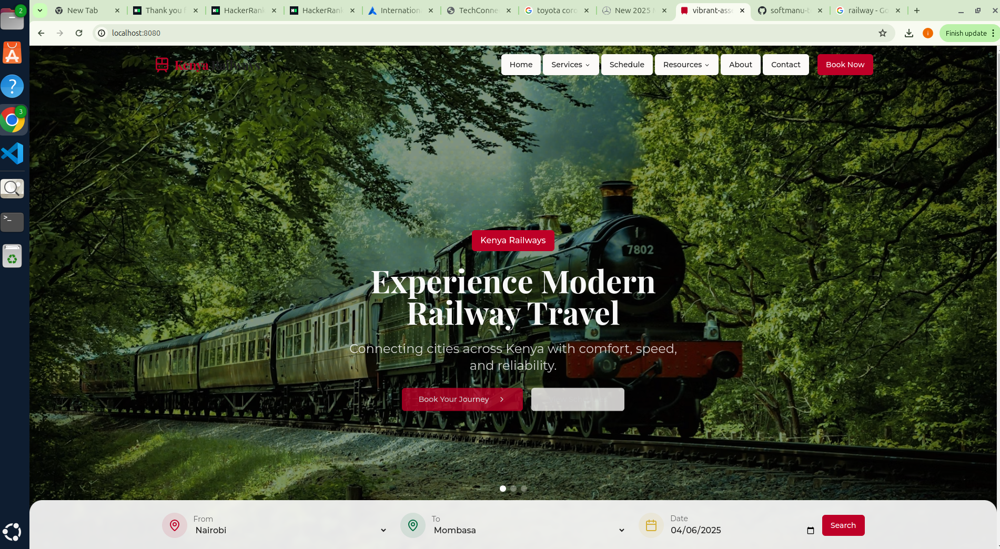
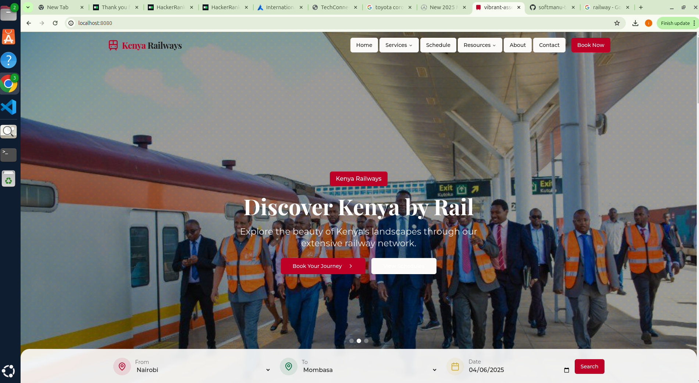
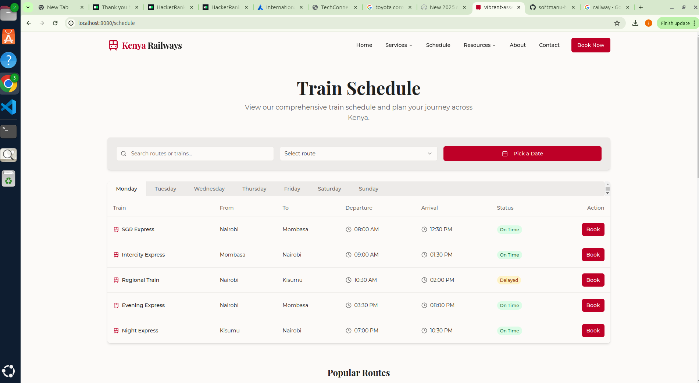
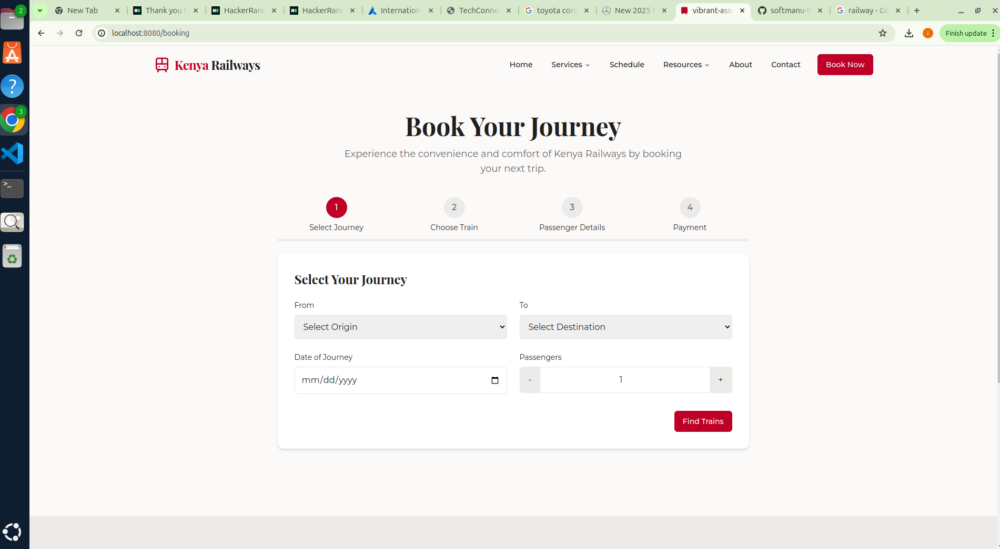
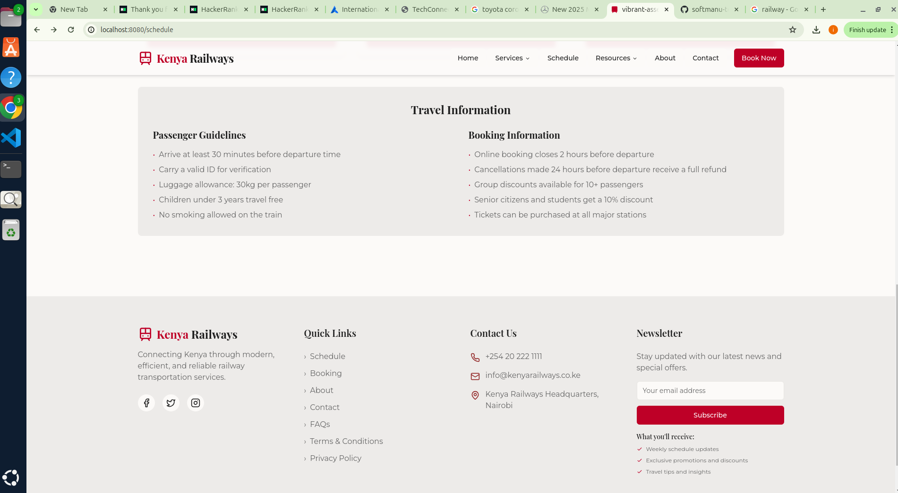

# Welcome to Work in Progress


## Project info







Follow these steps:

```sh
# Step 1: Clone the repository using the project's Git URL.
git clone <YOUR_GIT_URL>

# Step 2: Navigate to the project directory.
cd <YOUR_PROJECT_NAME>

# Step 3: Install the necessary dependencies.
npm i

# Step 4: Start the development server with auto-reloading and an instant preview.
npm run dev
```

**Edit a file directly in GitHub**

- Navigate to the desired file(s).
- Click the "Edit" button (pencil icon) at the top right of the file view.
- Make your changes and commit the changes.

**Use GitHub Codespaces**

- Navigate to the main page of your repository.
- Click on the "Code" button (green button) near the top right.
- Select the "Codespaces" tab.
- Click on "New codespace" to launch a new Codespace environment.
- Edit files directly within the Codespace and commit and push your changes once you're done.

## What technologies are used for this project?

This project is built with:

- Vite
- TypeScript
- React
- Next.js
- shadcn-ui
- Tailwind CSS

## What is the purpose of this project?

This project is a showcase of how to use Tailwind CSS and React to create a dynamic and interactive user interface for a railway dream. The project includes a simple animation library, a component library, and a set of interactive examples that demonstrate the capabilities of the library. The goal is to provide a fun and engaging way for users to explore and experiment with the animations and components.

## How can I contribute to this project?

Contributions are welcome!